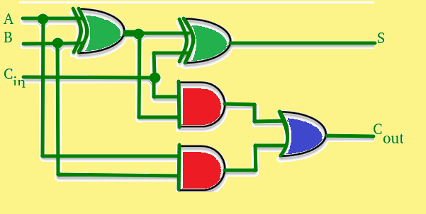
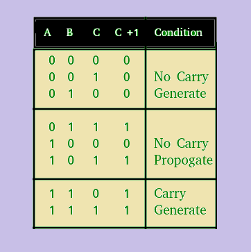
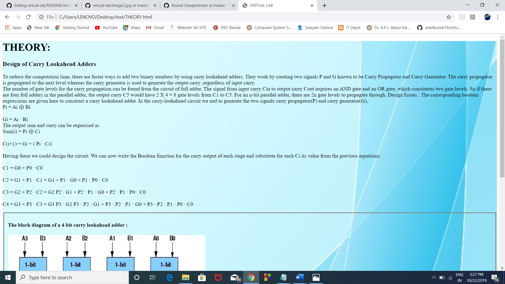
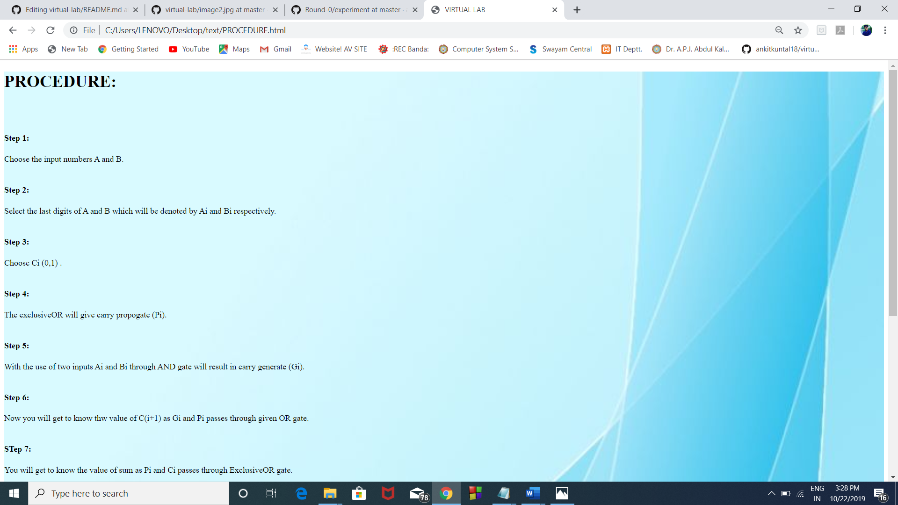

## Storyboard (Round 2)

Experiment 1: carry look ahead adder

### 1. Story Outline:

The experiment is based on Carry Look-ahead Adder In ripple carry adders, for each adder block, the two bits that are to be added are available instantly. However, each adder block waits for the carry to arrive from its previous block. So, it is not possible to generate the sum and carry of any block until the input carry is known. The (i)th block waits for the (i-1)th block to produce its carry. So there will be a considerable time delay which is carry propagation delay.

)
### 2. Story:

To reduce the computation time, there are faster ways to add two binary numbers by using carry lookahead adders. They work by creating two signals P and G known to be Carry Propagator and Carry Generator. The carry propagator is propagated to the next level whereas the carry generator is used to generate the output carry, regardless of input carry.
Carry Look-ahead Adder :
A carry look-ahead adder reduces the propagation delay by introducing more complex hardware. In this design, the ripple carry design is suitably transformed such that the carry logic over fixed groups of bits of the adder is reduced to two-level logic. Let us discuss the design in detail.

        
The number of gate levels for the carry propagation can be found from the circuit of full adder. The signal from input carry C(in) to output carry C(out) requires an AND gate and an OR gate, which constitutes two gate levels. So, if there are four full adders in the parallel adder, the output carry C5 would have 2 X 4 = 8 gate levels from C1 to C5. For an n-bit parallel adder, there are 2n gate levels to propagate through.  
step 1:

 
step 2:

 
step:

 

#### 2.1 Set the Visual Stage Description:
Inputs are given visually to the gates. Both the inputs entered passes through the gates and performs the operation of sum and carry. Then the respective outputs are displayed visually to the user so that the user can understand the experiment properly. 
 
#### 2.3 Set the Pathway Activities:,

Input the four digits value in A and B. Select the respective Ai and Bi. enter the value of Ci and hence the operation is performed. Now the sum and carry is displays.

### 5. Challenges and Questions

Q1. Which one of the following is better way to compute sum in less time? 
a)half adder 
b)full adder 
c)n bit parllel adder 
d)carry lookahead adder 
ANS:-D 
Q2. Give the correct formula of Pi and Gi? 
a)Ai·BiandAi⊕Bi 
b)Ai+BiandAi.Bi 
c)Ai⊕BiandAi+Bi 
d)Ai⊕BiandAi-Bi 
ANS:-A 

### 6. Formulas and equations used :

Pi=Ai*Bi~ +Ai~ *Bi 
Gi=Ai*Bi 
Si=Pi*Ci~+Pi~*Ci 
C(i+1)=Gi + Pi*Ci 

### 7.Conclusion:
####  Study of logic gate has been done. Pi and Gi has been calculated and sum has been determined.

